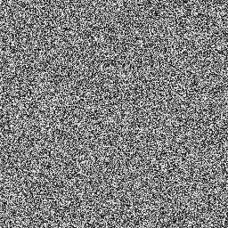
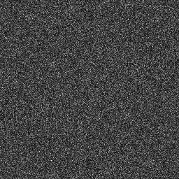
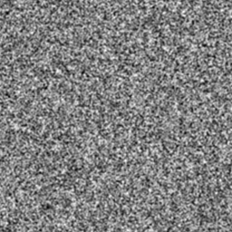
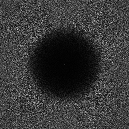

# Noise 2D

Noise2D is a C++17 header-only library for generating 2D noise. It has no dependencies outside the standard library.

Noise2D can generate white noise, brown noise, or blue noise. White noise is generated following a uniform distribution. Brown noise is generated by first generating white noise, then integrating the result. Blue noise is generated following Robert Ulichney's [Void and Cluster](https://cv.ulichney.com/papers/1993-void-cluster.pdf) algorithm.

| | Noise | Fourier |
|:--|:--|:--|
| White Noise |  |  |
| Brown Noise |  |  |
| Blue Noise |  |  |

## Usage

Copy `noise2d.h` into your project's include directory and `#include "noise2d.h"` in any files where you access the API.

## API

```cpp
template<typename T>
class Noise2D final
```

The base class for 2D noise generation. Type T can be any integral or floating-point type. The generated noise will be of type T.

```cpp
Noise2D(std::size_t width, std::size_t height, std::size_t output_levels = 2);
```

Constructor for Noise2D objects.

| Parameter     | Explanation                                                                                                                                                                                                                      |
|:--------------|:---------------------------------------------------------------------------------------------------------------------------------------------------------------------------------------------------------------------------------|
| width         | The width of the generated noise matrix.                                                                                                                                                                                         |
| height        | The height of the generated noise matrix.                                                                                                                                                                                        |
| output_levels | The number of output levels in the generated noise matrix. If noise is a floating-point type, this value is not used. If noise is an integral type, then the values in the generated noise matrix range from [0, output_levels). |

```cpp
[[nodiscard]] T get_noise_at(std::size_t x, std::size_t y) const;
```

Method to get the noise from the noise matrix at an (x, y) coordinate.

| Parameter | Explanation                                     |
|:----------|:------------------------------------------------|
| x         | The x coordinate of the generated noise matrix. |
| y         | The y coordinate of the generated noise matrix. |

| Returns                 |
|:------------------------|
| The desired noise data. |

| Throws                                                    |
|:----------------------------------------------------------|
| std::out_of_range if x exceeds width or y exceeds height. |

```cpp
void generate_blue_noise(double sigma = 1.9);
```

Method to generate blue noise using Ulichney's Void and Cluster algorithm.

| Parameter | Explanation                                                                                                                                                                                                                                            |
|:----------|:-------------------------------------------------------------------------------------------------------------------------------------------------------------------------------------------------------------------------------------------------------|
| sigma     | The standard deviation of the Gaussian function used to generate blue noise. Low values of sigma result in ordered patterns, while high values of sigma result in stronger low-frequency components. If not specified, a default value of 1.9 is used. |

```cpp
void generate_brown_noise(double leaky_integrator = 0.999);
```

Method to generate brown noise.

| Parameter        | Explanation                                                                                                                                                                         |
|:-----------------|:------------------------------------------------------------------------------------------------------------------------------------------------------------------------------------|
| leaky_integrator | A scalar that is multiplied by the integral sum each step to ensure the noise does not deviate far from zero in large matrixes. If not specified, a default value of 0.999 is used. |

```cpp
void generate_white_noise();
```

Method to generate white noise.

## Minimal Example

```cpp
#include "noise2d.h"
#include <array> // std::array

int main()
{
    Noise2D<int> noise_2d = Noise2D<int>(64, 64, 256); // create a 64x64 Noise2D object with 256 output levels
    noise_2d.generate_white_noise(); // fills the Noise2D noise matrix with white noise values from 0-255
    
    // initialize an empty array to hold data from the Noise2D noise matrix
    std::array<std::array<int, 64>, 64> noise_data;

    // fill noise_data with data from the Noise2D noise matrix
    for(int y = 0; y < 64; y++)
    {
        for(int x = 0; x < 64; x++)
        {
            noise_data[y][x] = noise_2d.get_noise_at(x, y);
        }
    }

    // use the noise data...

    return 0;
}
```

## Other Examples

Each example generates various sizes of noise matrixes of the specified color, benchmarks performance of the noise generation function call, creates a frequency domain matrix corresponding to the noise matrix, and saves both matrixes to .png files.

| File                    | Build Command      |
|:------------------------|:-------------------|
| example_blue_noise.cpp  | `make blue_noise`  |
| example_brown_noise.cpp | `make brown_noise` |
| example_white_noise.cpp | `make white_noise` |

The examples depend on [fftw3](https://www.fftw.org/) to generate Fourier transforms of the noise matrixes and [lodepng](https://lodev.org/lodepng/) to save the resulting matrixes to .png files. `fourier.c/.h` and `image.c/.h` provide wrappers for these libraries that simplify function calls. `libfftw3-3.dll` is a dynamically linked library compiled for Windows that must be present in the `bin` folder to run the example executables. The examples save generated images to the `./output` directory.
